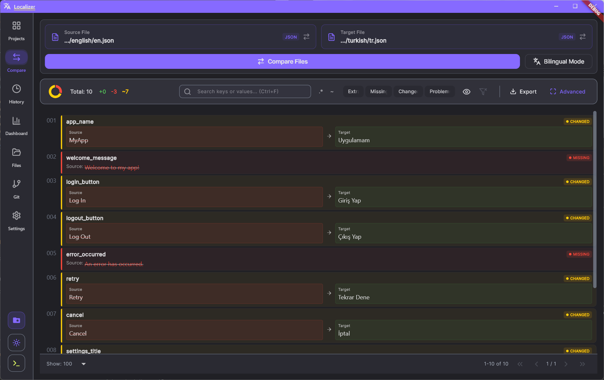
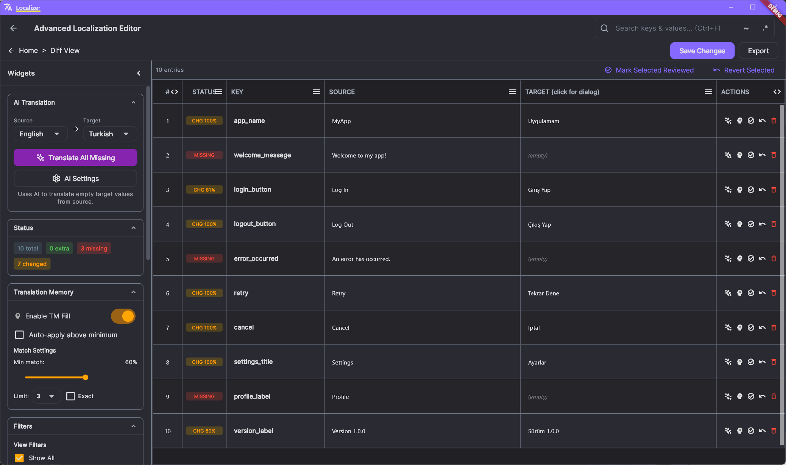
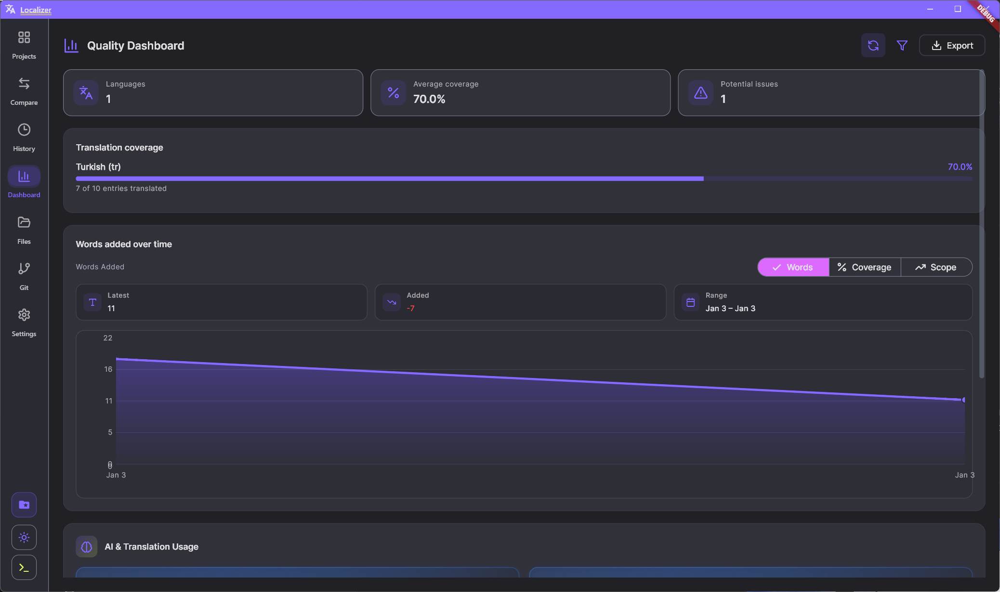
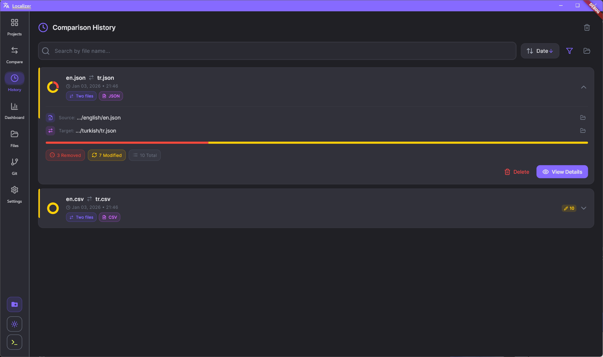
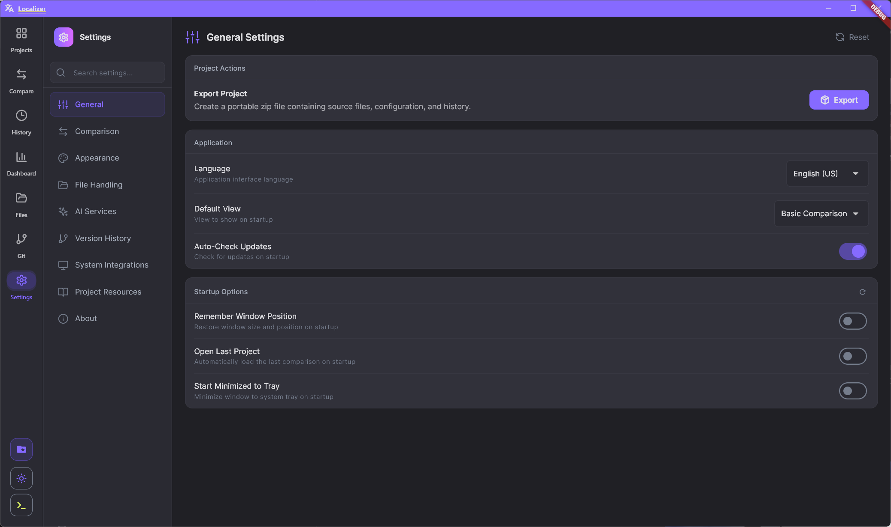

# Localization Comparison Tool

[](https://flutter.dev)
[](https://flutter.dev/desktop)
[](LICENSE)
[](https://github.com/KhazP/Localization-Comparison-Tool/actions/workflows/flutter.yml)
[](https://github.com/KhazP/Localization-Comparison-Tool/stargazers)

A desktop app for comparing, analyzing, and improving localization files with a fast diff workflow, quality checks, and AI-assisted translation support.

<div align="center">
  
</div>

## Mission

Localization work should be clear, fast, and trustworthy.

This project helps teams compare source and target translations, catch missing or risky changes early, and ship multilingual products with confidence.

## Development Status

Current status: Beta

- Core comparison, history, dashboard, and settings features are production-usable.
- Active development continues for AI and advanced workflow polish.

## Existing Analogues

This project takes inspiration from several translation and diff tools while focusing on desktop-first localization workflows:

- Pontoon and Weblate for collaborative localization ideas.
- Lokalise and Crowdin for quality and workflow concepts.
- Generic diff tools for side-by-side change inspection.

The differentiation here is a local desktop-first app that combines file diffing, translation quality checks, and AI-assisted workflow in one place.

## Free and Open Source

This project is free to use, free to fork, and open to contributions.

- Source code: https://github.com/KhazP/Localization-Comparison-Tool
- Issue tracker: https://github.com/KhazP/Localization-Comparison-Tool/issues
- Discussions: https://github.com/KhazP/Localization-Comparison-Tool/discussions

## Key Features

### Intelligent Comparison and Analysis
- Visual diff with added, removed, and modified indicators.
- Advanced row-level diff for deep analysis.
- Similarity detection for modified strings.

### Batch Processing and Directories
- Compare whole directories, not just single files.
- Smart matching for source and target files.

### Quality Dashboard
- Coverage and missing-translation visibility.
- Visual insights to track localization quality.

### History and Session Management
- Automatic session history.
- One-click restore for previous comparisons.

### Flexible Settings
- Theme and accent customization.
- AI provider configuration.
- Ignore patterns and comparison tuning.

## Supported File Formats

| Format | Extensions | Description |
|--------|------------|-------------|
| JSON | .json, .arb | Standard JSON and Flutter ARB files |
| XML | .xml | Android strings.xml and generic XML |
| XLIFF | .xliff, .xlf | Translation industry standard |
| TMX | .tmx | Translation Memory eXchange |
| CSV | .csv | Comma-separated values |
| YAML | .yaml, .yml | YAML localization/config files |
| Properties | .properties | Java/Kotlin properties |
| RESX | .resx | .NET resource files |

## Requirements

- Flutter SDK 3.19+
- Dart SDK (bundled with Flutter)
- Windows 10/11, macOS, or Linux desktop environment

## Download

- Latest release binaries: https://github.com/KhazP/Localization-Comparison-Tool/releases

## Installation

### Run from release package
1. Open the Releases page.
2. Download the latest desktop package.
3. Extract and run the application.

### Build from source

```bash
git clone https://github.com/KhazP/Localization-Comparison-Tool.git
cd Localization-Comparison-Tool
flutter pub get
dart run build_runner build --delete-conflicting-outputs
flutter run -d windows
```

## Communication Channels

- Discussions: https://github.com/KhazP/Localization-Comparison-Tool/discussions
- Mailing list style updates: follow Releases and Discussions (watch settings in GitHub)
- Real-time chat: fast-response support thread in Discussions Q&A
- Forum: GitHub Discussions categories (Q&A, Ideas, Announcements)

## Documentation

- User and project overview: [LocalizerAppMain.md](LocalizerAppMain.md)
- Technical decisions: [TECHNICAL.md](TECHNICAL.md)
- Changelog: [CHANGELOG.md](CHANGELOG.md)
- Website docs: [docs/index.html](docs/index.html)
- FAQ: [FAQ.md](FAQ.md)

## Developer Guidelines

- Contributing guide: [CONTRIBUTING.md](CONTRIBUTING.md)
- Code of conduct: [.github/CODE_OF_CONDUCT.md](.github/CODE_OF_CONDUCT.md)
- Security policy: [.github/SECURITY.md](.github/SECURITY.md)
- Governance: [GOVERNANCE.md](GOVERNANCE.md)
- Support policy: [SUPPORT.md](SUPPORT.md)

## Examples and Screenshots

<div align="center">
  
  
  
  
</div>

## Contributing

Contributions are welcome and appreciated.

Please read [CONTRIBUTING.md](CONTRIBUTING.md) before opening a pull request.

## License

This project is licensed under the Mozilla Public License 2.0. See [LICENSE](LICENSE).
