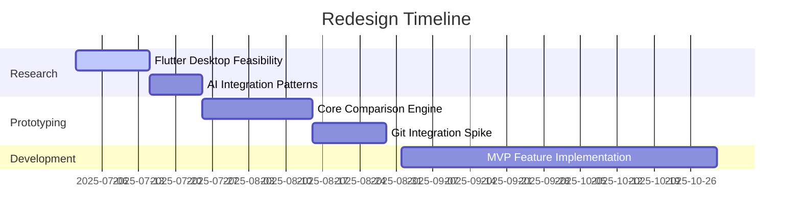

# Research Brief: Redesigning the Localization Comparison Tool with Flutter

## Executive Summary

This research brief outlines the strategic foundation for rebuilding the Localization Comparison Tool as a modern Flutter-based desktop application. The project aims to address technical debt, expand feature capabilities, and improve user experience while maintaining Windows compatibility. Key focus areas include architectural scalability, AI/ML integration, and developer-friendly workflows, informed by current best practices in cross-platform development[2][16].

---

## 1. Research Topic Confirmation

**Core Objective:**
Redesign the existing Python/Flet-based Localization Comparison Tool ([GitHub](https://github.com/KhazP/LocalizerAppMain)) using Flutter to achieve:

1. **Technical Modernization**: Migrate from Flet to Flutter for improved performance and maintainability[16]
2. **Feature Expansion**: Implement Git integration, AI-assisted translations, and enhanced file format support[12][8]
3. **UX Overhaul**: Modern desktop-first interface with dark mode default and adaptive layouts[5][3]

**Confirmed Scope Boundaries:**

- **Platform Focus**: Windows desktop-only deployment initially[16]
- **Excluded Areas**: Mobile/web support, legacy Python code integration

---

## 2. Primary Goals \& Objectives

**Strategic Outcomes:**

| Priority | Objective | Success Metric |
| :-- | :-- | :-- |
| Critical | Reduce maintenance complexity | 50% fewer codebase issues vs original Flet implementation[14] |
| High | Enable CI/CD localization workflows | Git integration for version-controlled translations[8] |
| Medium | AI-powered translation suggestions | 30% reduction in manual translation efforts via MLKit[10] |

**Key Technical Challenges:**

1. **File Parsing Performance**: Optimize large file handling (>100k strings) using Flutter's isolate system[14]
2. **Cross-Format Consistency**: Unified parser architecture for 15+ file types (Android XML, JSON, XLIFF, etc.)[12]
3. **State Management**: BLoC pattern for complex comparison workflows[4]

---

## 3. Scope \& Technical Requirements

**Core Feature Matrix (MoSCoW):**

| Category | Requirements |
| :-- | :-- |
| **Must Have** | - Real-time directory comparison   - Translation history with diff tracking[9]   - Dark/light theme system[5] |
| **Should Have** | - Git version control integration[8]   - Google Translate API integration[10] |
| **Could Have** | - Automated translation memory   - Collaborative editing features |
| **Won't Have** | - Mobile app support   - Legacy Python code migration |

**Technical Specifications:**

- **Architecture**: Clean Architecture + BLoC state management[4]
- **Critical Libraries**:
    - `libgit2dart` for Git operations[8]
    - `google_mlkit_translation` for AI features[10]
    - `window_size` for native desktop window management[16]
- **Performance Targets**:
    - <500ms response time for 10k-string files
    - <100MB memory usage during active comparisons[14]

---

## 4. Target Audience \& Use Cases

**Primary Users:**

1. **Developers**:
    - Technical users managing multilingual codebases
    - Requires CLI support and CI/CD integration[17]
2. **Translators**:
    - Non-technical users needing visual diff tools
    - Benefits from machine translation aids[10]

**Stakeholder Map:**

- **Decision Maker**: Solo developer (KhazP)
- **End Users**: Open-source community contributors

---

## 5. Research Methodology

**Technical Investigation Areas:**

1. **Flutter Desktop Maturity**:
    - Window management and system tray integration[16]
    - MSIX packaging for Windows Store deployment[6][7]
2. **AI/ML Integration Patterns**:
    - On-device vs cloud translation models[10]
    - Privacy-preserving analytics implementation[11]
3. **Performance Optimization**:
    - Isolate-based file parsing[14]
    - Memory-efficient diff algorithms

**Source Priorities:**

1. Flutter Desktop Documentation[16][3]
2. ML Kit Translation SDK[10]
3. Microsoft Store Publishing Guides[7]
4. Modern Desktop UX Patterns[5][20]

---

## 6. Risk Mitigation Strategy

**Identified Risks:**

| Risk | Mitigation |
| :-- | :-- |
| Flutter desktop plugin instability | Lock core dependencies + maintain fork readiness |
| Large file handling performance | Prototype isolate-based parsing early |
| AI translation cost control | Implement usage caps + local caching |

**Validation Approach:**

- **Phase 1**: Architectural spike testing file parser scalability
- **Phase 2**: UX prototype validation with translator focus group
- **Phase 3**: Performance benchmarking vs legacy Python version

---

## 7. Deliverables Roadmap

**Research Outputs:**

1. **Technical Specification Document**:
    - Architecture diagrams
    - Dependency compatibility matrix
2. **MVP Feature Backlog**:
    - Prioritized implementation sequence
3. **Migration Guide**:
    - Flet-to-Flutter pattern equivalencies

**Development Timeline:**

---

## 8. Sustainability Considerations

**Long-Term Maintainability:**

- **Code Quality**: Enforce 80%+ test coverage from inception[14]
- **Documentation**: Living architecture decision records
- **Community Building**: Early access program for open-source contributors

**Evolution Path:**

1. v1.0: Windows desktop core features
2. v2.0: Cross-platform expansion (Linux/macOS)
3. v3.0: Cloud sync capabilities

---

## Next Steps

1. Finalize architecture spike on file parser performance
2. Create Figma UI prototype for validation
3. Establish CI/CD pipeline with Windows build agents

*This brief synthesizes technical requirements with KhazP's development constraints as a solo maintainer, emphasizing pragmatic scalability and maintainability.*

